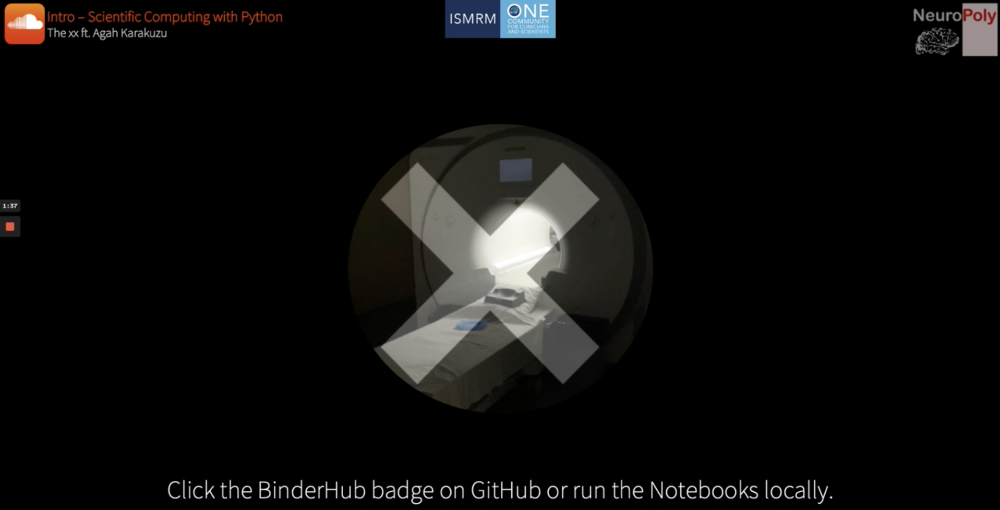
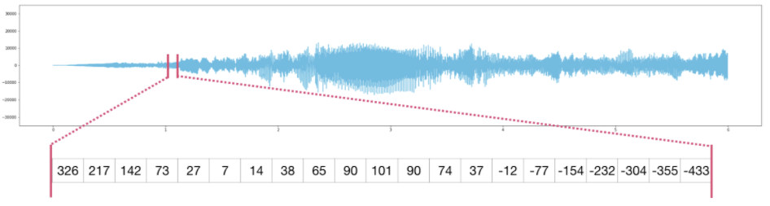
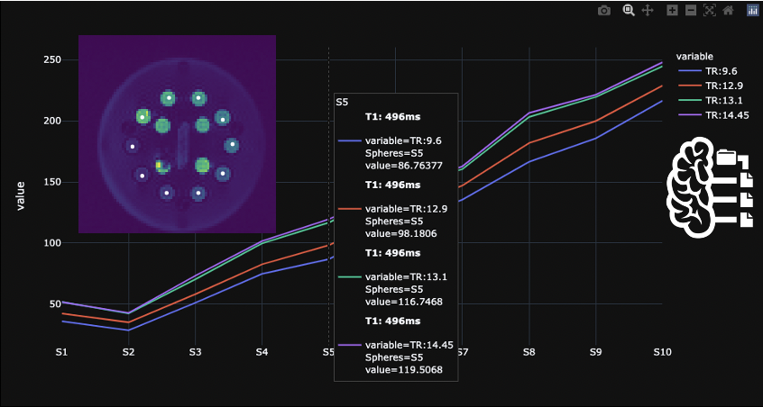
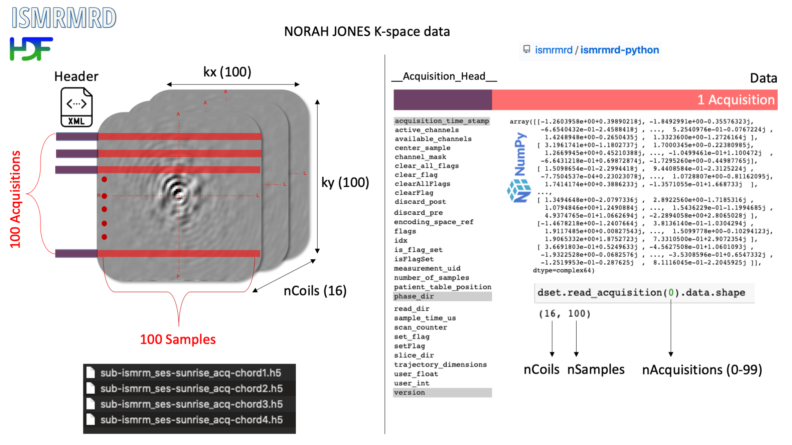
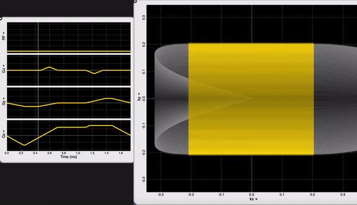
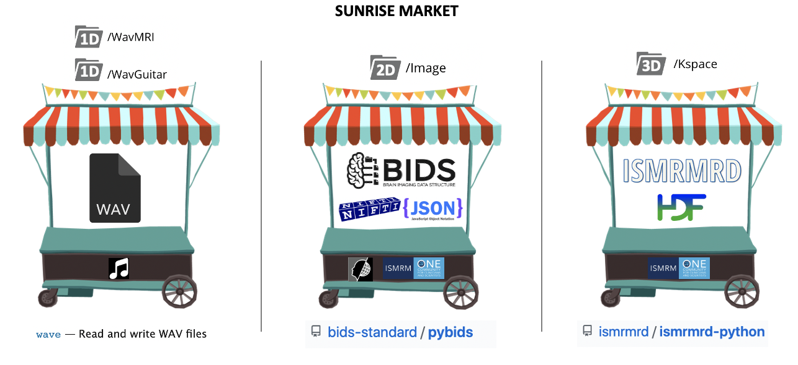
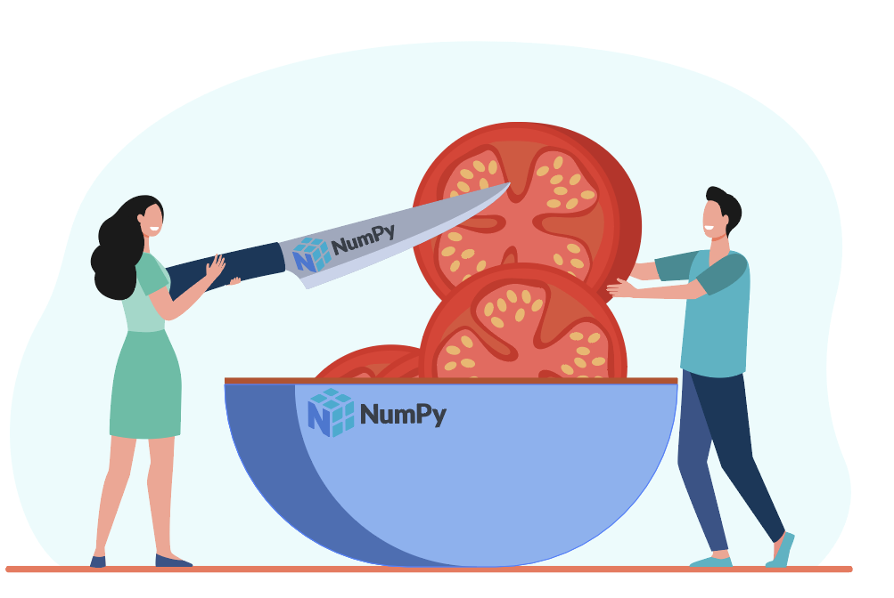
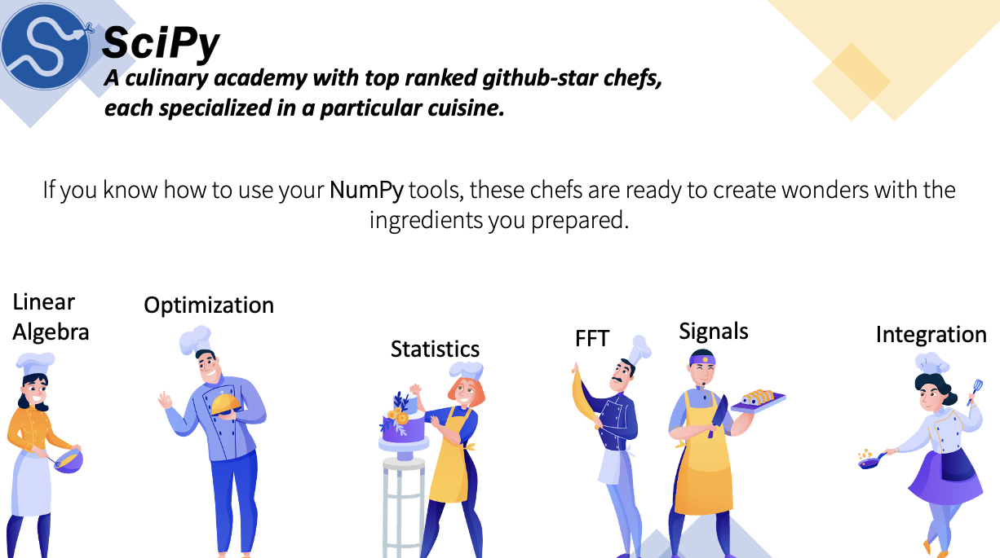

# Scientific computing with Python

Course material presented at [ISMRM 2021 Sunrise Educational Session](https://www.ismrm.org/21/program-files/T-30.htm) for Python Programming & Scientific Computing.

[](https://www.youtube.com/watch?v=XX0UGblIwMM)

[⏯  The XX - Intro | MRI edition](https://www.youtube.com/watch?v=XX0UGblIwMM)

### 📚 3 Notebooks for 3 dimensions of MRI

* [1D-MUSIC.ipynb](/1D-MUSIC.ipynb) for basic NumPy operations and SciPy functions to create harmonious MRI melodies.

* [2D-BIDS.ipynb](/1D-MUSIC.ipynb) for querying reconstructed images using BIDS layout, loading them using `nibabel`, `parsing them` using `NumPy` and creating interactive plots using `Plotly`.

* [3D-ISMRMD.ipynb](/1D-MUSIC.ipynb) for reading ISMRM-RD k-space data (16 channels) using `ismrmrd-python`, reconstructing them using `SciPy` and creating interactive plots using `Plotly`.

### 🕸  You can execute the notebooks online
[](https://mybinder.org/v2/gh/agahkarakuzu/sunrise/HEAD)

### 📥  Instructions for running notebooks on your computer

#### 1. Clone this repository 

```
git clone https://github.com/agahkarakuzu/sunrise.git
```

#### 2. Choose one of the following options

<details><summary> <b>💻  Local Python environment</b> </font> </summary><br>

### Python 

If you don't have Python installed on your computer, I highly recommend [Anaconda](https://www.anaconda.com/). Simply follow the instructions on the website to install Anaconda, which comes with Jupyter out of the box. 

Then all you have to do is simply installing Python dependencies using `pip`. In a terminal window:

```python
cd /directory/to/sunrise/on/your/computer
pip install -r requirements.txt
```

That's all! After installing dependencies, run `jupyter notebook` or `jupyter lab` command in the terminal (while you are still at the `/sunrise` directory. Select a notebook, and start making some music using MRI sounds! 


### Potentially missing dependencies 

* If you cannot run Librosa on a Ubuntu OS, you may be missing `libsndfile1` package: 

```terminal
sudo apt install libsndfile1
```

* Lolviz package (visualizing arrays using a graphical representation) is optional. You can follow the [official docs](https://github.com/parrt/lolviz) to install its dependencies on different OS.

* I did not test this on a Windows machine, please open an issue if you run into problems.


</details>

<details><summary> <b>🐳  Use with Docker</b> </font> </summary><br>

If you have Docker installed on your computer and running, you can run the code 
in the same environment described in this repository. 

### Option-1: Use `repo2docker` 

1. Simply install `repo2docker` from pyPI: 
```
pip install jupyter-repo2docker
```
2. Run the following command in your terminal:
```
jupyter-repo2docker https://github.com/agahkarakuzu/sunrise
```

After building (it might take a while!), it should output in your terminal 
something like:

```
Copy/paste this URL into your browser when you connect for the first time,
    to login with a token:
        http://0.0.0.0:36511/?token=f94f8fabb92e22f5bfab116c382b4707fc2cade56ad1ace0
```

This should start a Jupyter session on your browser and make all the resources 
you see when you [launch a Binder](https://mybinder.org/v2/gh/agahkarakuzu/sunrise/main) for this repository. 

To re-use your container built by repo2docker, do the following: 

1. Run `docker images` command and copy the `IMAGE ID` to your clipboard 
2. Run the following command to start the container:
```
docker run -it --rm -p 8888:8888 `PASTE IMAGE ID HERE` jupyter notebook --ip 0.0.0.0
```

### Option 2: Use Docker image built by this repo's GitHub Actions

This repository builds and pushes its own Docker images on every release! 

You can see the available versions [here](https://hub.docker.com/r/agahkarakuzu/sunrise). I will give the instructions for the 
latest version: 

1. Pull the docker image
```
docker pull agahkarakuzu/sunrise:latest
```
2. Start the container
```
docker run -it --rm -p 8888:8888 agahkarakuzu/sunrise:latest
```

</details>

## Special thanks 


My friend Bengü Aktas recorded vocals for this project. She's a [singer](https://www.youtube.com/channel/UC2LUEX92eaq_6VQzIAZnnCw/featured) and a [visual artist](https://www.behance.net/profile/benguaktas) who can also modify Si wafer surfaces to create [bio-compatible micro-environments](https://ieeexplore.ieee.org/document/7026352). Thank you Bengü!

## Equipment 

* Scanner: 3T Siemens Skyra with RTHawk
* Microphone: Audio Technica AT2020usb+ 
* Acoustic guitar: Taylor 114ce

## How to run NORAH JONES pulse sequence on your scanner?



The [pulse sequence](/Sequence) is publicly available. If you have RTHawk real-time imaging platform, you can run it on a Siemens or GE scanner.

The pulse sequence is a simple SPGR with 4 varying TRs played in succession. The sequence can export ISMRM-RD and BIDS compatible raw and reconstructed images. 

Visit [qMRPullseq](https://github.com/qmrlab/pulse_sequences) for other pulse sequences made available for quantitative MRI.

## What makes this Python course special?

There are hundreds of free Python courses online to learn about NumPy and SciPy. You may ask, why create another one?

* This one is _artfully_ tailored for MRI scientists. I always wanted to make some music with MRI sounds. I took this opportunity to do it in Python and share it with you.
* All the notebooks are given in the context of a typical image processing workflow, with an analogy to cooking: 
   * **Shopping** The ingredients we need to work with MRI data are sold in certain formats (DICOM, NIfTI, BIDS, ISMRM-RD etc.) in the marketplace. Without knowing the basics about these ingredients, we can't cook.
   
   * **Mise en place** Depending on our research question or application, we often need to dice and slice our data in different ways. `NumPy` is the brand of our chef's knife and all the utensils to put everything in place.
   
   * **SciPy culinary academy** You can imagine `SciPy` (or any other Python package) as a culinary academy of Michelin Star Chefs, who are willing to cook your meal for free, if you did the preparation.
   
   * **Share** Everything tastes better when you share. IMHO, sharing our MRI processing recipe with others is a requirement rather than a choice. 


<p align="center"> <b>It is always good to know what you eat.</b> </p>
   
<p align="center">  </p>

<p align="center"> To that end, I equipped this repository with some tools to foster transparency & reproducibility. </p>


### Last, but not the least

Almost 1.5 years into the pandemic, I feel more and more like [an analog guy in a digital world](https://www.youtube.com/watch?v=OkQlrIQhUMQ). I wanted to encourage creativity to take your mind off the stress of seeking an academic degree in a digital world, and to make MRI art while learning some Python. 

If we are lucky to see digital-to-analog conversion happening next year, I would like to hear Python-generated MRI musics in the next [MRM Highlights Party](https://www.facebook.com/watch/?v=730147610778171).

Please feel free to send a pull request to this repository by adding your MRI music in the `REMIX` folder. It does not matter if you used Python, C++, GarageBand, Logic Pro or even a synthesizer. All contributions are welcome! 

### Bonus 

@mathieuboudreau created a fascinating Spotify playlist: [unintentionally ISMRM](https://open.spotify.com/playlist/1U8vbOJFSIRQhiu3ZLvgM8?si=0e4d362e3c544999). I hope that it serves as a source of inspiration for you to create magnetic melodies that are "intentionally ISMRM". 

## References and useful resources

* [AllenDowney/ThinkDSP](https://github.com/AllenDowney/ThinkDSP) was a great source of inspiration, I highly recommend his [SciPy 2015 talk](https://www.youtube.com/watch?v=0ALKGR0I5MA). 

* The amazing [Pianoputer project](http://zulko.github.io/blog/2014/03/29/soundstretching-and-pitch-shifting-in-python/)

* [Visual NumPy](https://jalammar.github.io/visual-numpy/), [Pictorial Numpy tutorial](https://towardsdatascience.com/reshaping-numpy-arrays-in-python-a-step-by-step-pictorial-tutorial-aed5f471cf0b), [the Visual Guide to NumPy](https://betterprogramming.pub/numpy-illustrated-the-visual-guide-to-numpy-3b1d4976de1d)

* [Librosa official documentation](https://librosa.org/doc/latest/index.html)

* [100 Numpy Exercises](https://github.com/rougier/numpy-100)

* [Software carpentry Python course](https://swcarpentry.github.io/python-novice-inflammation/)

* [Real Python](https://realpython.com/)

* [Podcast: Talk Python to me](https://talkpython.fm/)

* [Commanline Heroes: Python's tale](https://www.youtube.com/watch?v=eaP4b2nAqm8)

### EarSketch: Make beats & Learn code

I found out about [EarSketch](https://earsketch.gatech.edu/landing/#/) while creating this repository. It allows you to: 

* Learn coding through music
* Use our sounds or your own (means that you can use files in the [`WavMRI`](/WavMRI) folder!)
* Learn Python or JavaScript code
* Produce studio-quality music

All in a web browser. It is a great opportunity to improve your algorithmic thinking skills. You need to create an account and login to be able to upload your sound samples. You can export them to SoundCloud with one click. I gave it a [try](https://soundcloud.com/agah-karakuzu/quick_tour-py), it works!

## Python projects for MRI scientists by NeuroPoly

* [IvadoMed](https://ivadomed.org/en/latest/)

* [Spinal Cord Toolbox](https://github.com/neuropoly/spinalcordtoolbox)

* [Shimming Toolbox](https://shimming-toolbox.org/en/latest/)

* [AxonDeepSeg](https://github.com/neuropoly/axondeepseg)

Vector illustrations in this project are under Freepik Premium license ag_e843bcd6** (Unlimited use without attribution).
